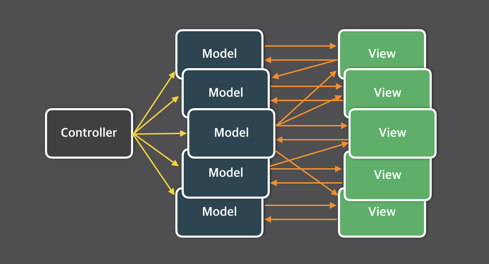
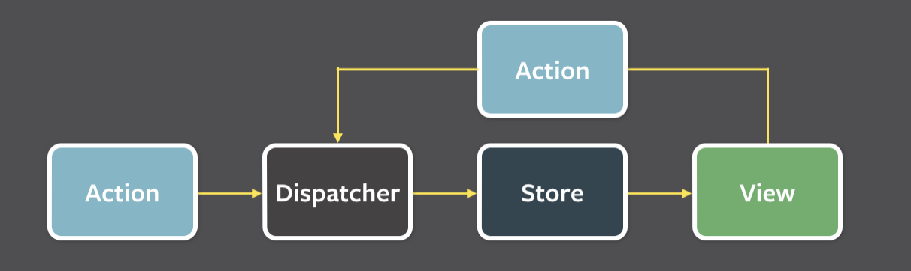

# Flux

- MVC경우 대규모 애플리케이션의 경우 MVC가 너무 빠르고 복잡해 진다는 점이 있음
- 이럴 경우 코드 예측이나 테스트의 어려움, 유지보수 비용 증가 등 여러가지 문제가 발생
- 이를 극복하고자 Facebook에서 만든 아키텍처

## 구조

- Flux 아키텍처의 데이터는 단방향으로 흐름
- 데이터 흐름은 항상 Dispatcher에서 Store로, Store에서 View로, View는 Action을 통해 다시 Dispatcher로 데이터가 흐름
- 이런 단방향 데이터 흐름은 데이터 변화를 휠씬 예측하기 쉽게 만듬

### Dispatcher
- Flux 애플리케이션의 모든 데이터 흐름을 관리하는 허브 역할
- Action이 발생하면 Dispatcher로 메시지(또는 Action 객체)가 전달되고 Dispatcher는 Dispatcher에 등록된 콜백 함수를 통해 이 메시지를 Store에 전달
- Dispatcher는 전체 어플리케이션에서 한 개의 인스턴스만 사용

### Store
- 어플리케이션의 모든 상태 변경은 Store에 의해 결정
- Flux의 Store는 상태를 다루기 때문에 무엇이든 저장할 수 있고 단순한 Object로 구성
- Dispatcher로 부터 메시지를 수신 받기 위해서는 Dispatcher에 콜백 함수를 등록해야 함
- Store가 변경되면 View에 변경되었다는 사실을 알려주게 됨
- Store은 싱글톤으로 관리

### View
- 상태를 가져와서 보여주고 입력받을 화면을 보여줄 역할
- 컨트롤러 뷰는 스토어와 뷰 사이의 중간관리자같은 역할을 하며, 상태가 변경되었을 때 Store가 그 사실을 컨트롤러 뷰에게 알려주면, 컨트롤러 뷰는 자신 아래에 있는 모든 뷰에게 새로운 상태를 넘겨줌

### Action
- Dispatcher로 특징 메소드를 실행하면 Store에 변화를 일으킬 수 있는데 이때 이 데이터 묶음을 Action이라 하고, 전달할 Action 객체는 Action 생성자라는 함수를 통해 만들어짐
- 뷰에서 Action 생성자(Action creator)를 실행하여 전달할 메세지을 생성하고, Dispatcher에 전달하여 Store에 저장되어 있는 상태를 변경하는 것
