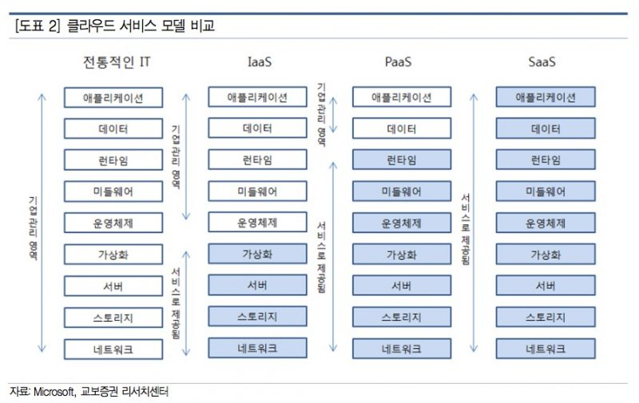

# Cloud Computing

## IaaS (Infrastructure as a Service)
- 가장 기본적인 범주
- 클라우드 공급자로부터 종량제 방식으로 서버와 VM, 스토리지, 네트워크, 운영 체제 등의 IT 인프라를 대여
- 즉, 인프자 자원을 서비스
- 컴퓨터 자원: CPU 코어의 개수, 메모리의 용량, 하드디스크 등등 컴퓨터 자원을 사용자가 원하는 형태로 제공

## PaaS (Platform as a Service)
- 소프트웨어 애플리케이션을 개발, 테스트, 제공 및 관리하기 위한 주문형 환경을 제공
- 개발자가 개발에 필요한 서버, 스토리지, 네트워크 및 데이터베이스의 기본 인프라를 설정하거나 관리할 필요 없이 더 쉽고 빠르게 웹앱이나 모바일 앱을 만들 수 있도록 디자인됨
- 즉, 개발에 필요한 환경을 서비스
- 컴퓨터 자원 + 플랫폼까지(개발환경) 제공

## SaaS (Software as a Service)
- 인터넷을 통해 주문형과 일반적인 구독 방식으로 소프트웨어 애플리케이션을 제공
- 클라우드 공급자는 소프트웨어 애플리케이션과 기본 인프라를 호스트하고 관리하며 소프트웨어 업그레이드 및 보안 패치와 같은 유지 관리를 처리
- 사용자는 일반적으로 휴대폰, 태블릿 또는 PC에서 웹 브라우저를 사용하여 인터넷을 통해 애플리케이션에 연결
- 즉, 사용자가 원하는 소프트웨어를 서비스
- 소프트웨어까지 모두 다 제공 (사용자는 사용만 하면 됨)

