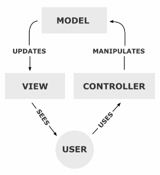

# Model–View–Controller, MVC

## Model
- 모델은 모델의 상태에 변화가 있을 때 컨트롤러와 뷰에 이를 통보
- 이와 같은 통보를 통해서 뷰는 최신의 결과를 보여줄 수 있고, 컨트롤러는 모델의 변화에 따른 적용 가능한 명령을 추가·제거·수정할 수 있음
- 어떤 MVC 구현에서는 통보 대신 뷰나 컨트롤러가 직접 모델의 상태를 읽어 오기도 함
- 즉, `무엇`을 할 것인지를 정의

## View
- 뷰는 사용자가 볼 결과물을 생성하기 위해 모델로부터 정보를 얻어 옴
- 즉, 화면에 무엇인가를 `보여주기` 위한 역할

## Controller
- 컨트롤러는 모델에 명령을 보냄으로써 모델의 상태를 변경할 수 있음 (예: 워드 프로세서에서 문서를 편집하는 것)
- 또, 컨트롤러가 관련된 뷰에 명령을 보냄으로써 모델의 표시 방법을 바꿀 수 있음 (문서를 스크롤하는 것)
- 즉, `어떻게` 처리할 지를 알려주는 역할

## Pros
- 유연하고 확장이 쉬움
- 협업이 용이

## Cons
- 대규모 프로그램에서는 컨트롤러가 비대해짐
- 수정 시 테스트가 어려움 (Side effect)
- 클래스가 많이 필요해지는 등 복잡해짐
