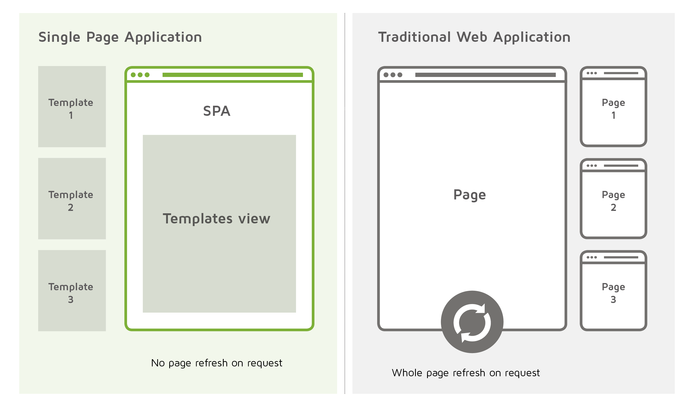

# Single Page Application

- SPA는 현재 웹개발의 트렌드
- 말 그대로, 페이지가 하나인 어플리케이션
- 기존의 웹 개발방식은 요청에 따라 서버에서 리소스와 데이터를 보내어 렌더, SPA는 최초 페이지 전체 로드 후 특정 부분만 Ajax를 통해 데이터를 바인딩
- 브라우저에서 자연스러운 환경을 제공하기위해 노력하면서 뛰어난 UX를 제공
- 페이지 리로드가 업음

## Pros
- HTML, CSS, Javascript를 어플리케이션 라이프사이클에서 한번만 로드 후 서버와 데이터만 주고 받음
- 개발이 간편하고 간소화
- SPA는 모든 로컬스토리지를 효율적으로 캐시할 수 있음

## Cons
- SEO 최적화가 어렵지만 최근에는 서버사이드 렌더링등으로 많이 개선됨
- 자바스크립트의 메모리 부족은 어플리케이션 속도를 저하시킬 수도 있음
