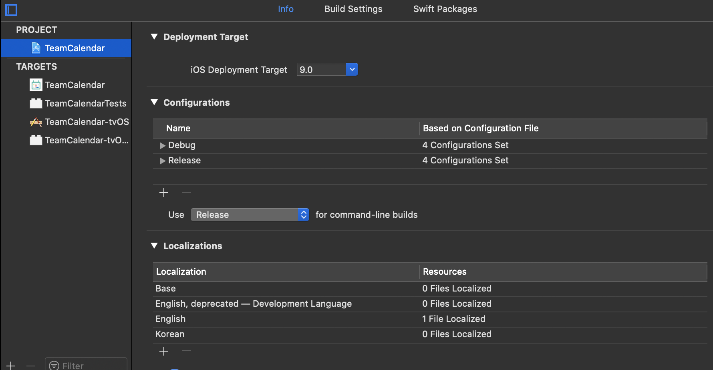
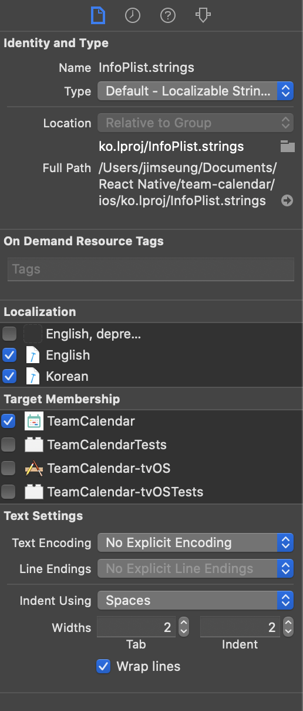

# Localize Info.plist
1. 프로젝트 `Info.list`가 있는 폴더에 `InfoPlist.strings` 생성
2. 좌측 파일 네비게이션창에서 최상단 프로젝트 선택해서 앱 설정화면으로 이동
3. **PROJECT**를 선택하고 **Localizations**에 원하는 언어 추가 (여기서는 Korean)

4. 네비게이션에서 `InfoPlist.strings` 선택 후 우측 **Inspectors** 창에서 `Localize...` 클릭
5. 팝업창에서 원하는 언어 선택
6. 다시 우측 **Inspectors**를 보면 **Localizations**에 선택한 언어만 체크되어있는데 추가로 원하는 언어 체크하면 관련 언어 전용파일이 생성됨

1. `"NSCalendarsUsageDescription" = "";` 식으로 `<key>`값 넣고 수정 텍스트 넣으면 끝
